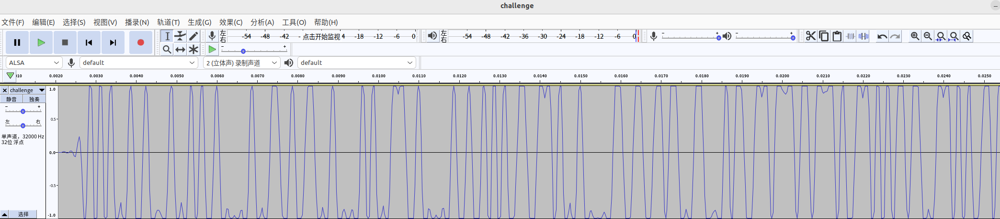
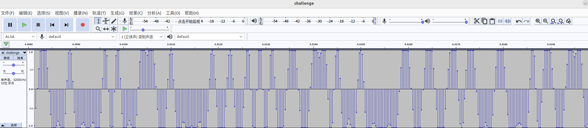
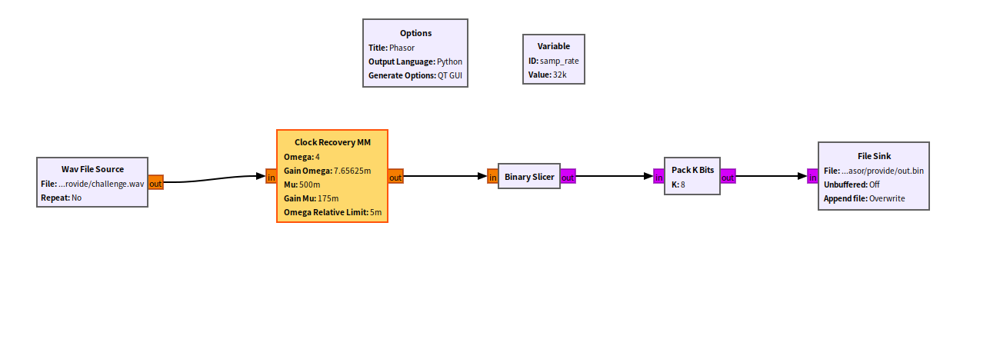
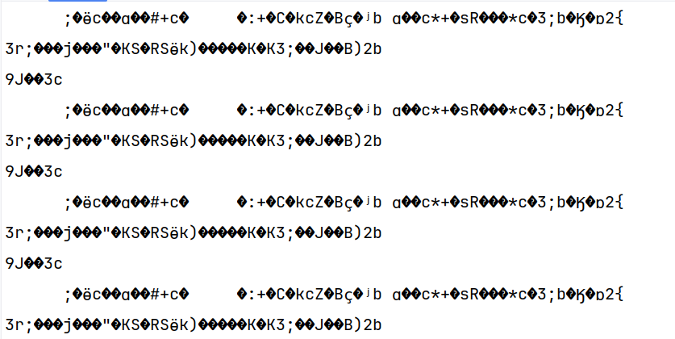
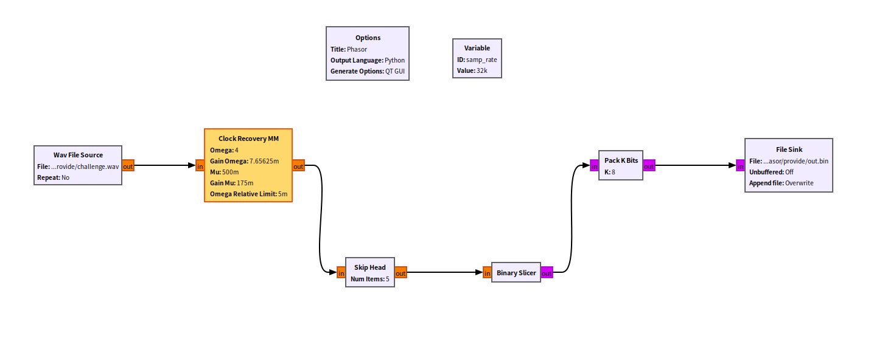
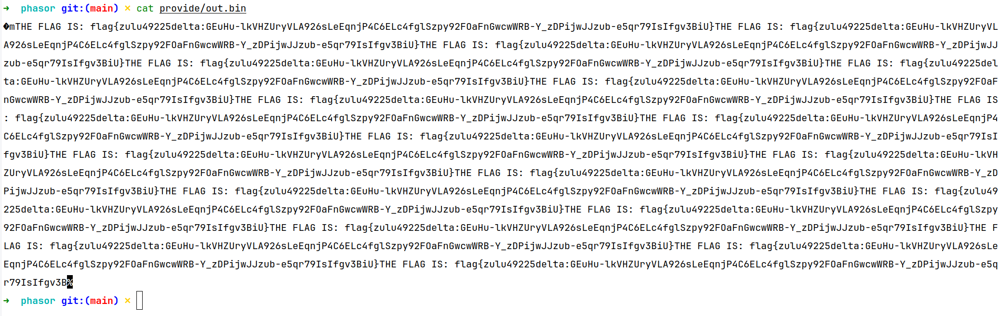
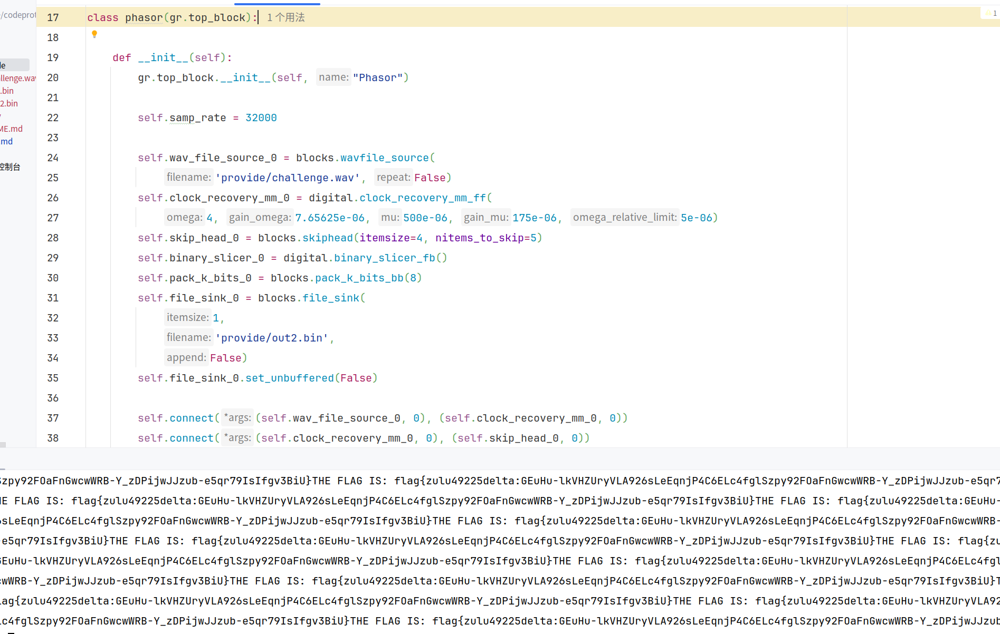

# 简单的卫星通信信号分析
题目提供：sdr捕获的数据challenge.wav
题目目的：解调sdr数据

背景知识：
- 信道编码/信道解码
- 数字调制/数字解调
- 信道
- 噪声源
- RZ、NRZ、NRZI编码（基本码型）
- 数字调制基本形式
  - 模拟调制
  - 键控法调制（ASK、FSK、PSK）
- GNU Radio Companion(GRC)使用
- Audacity(misc中常用的)

题目分析：
分析波形图，一系列规则的脉冲，PSK 信号在时域上可能看起来像一系列的方波，每个方波的相位变化代表不同的二进制值

urh psk自动解调，NRZI编码

更详细波形。采样率32000Hz,周期性波形，连续两个峰值间就是周期也就是4个样点

GNU Radio

生成的output.bin不对

重新更改，位对齐后

脚本编写

